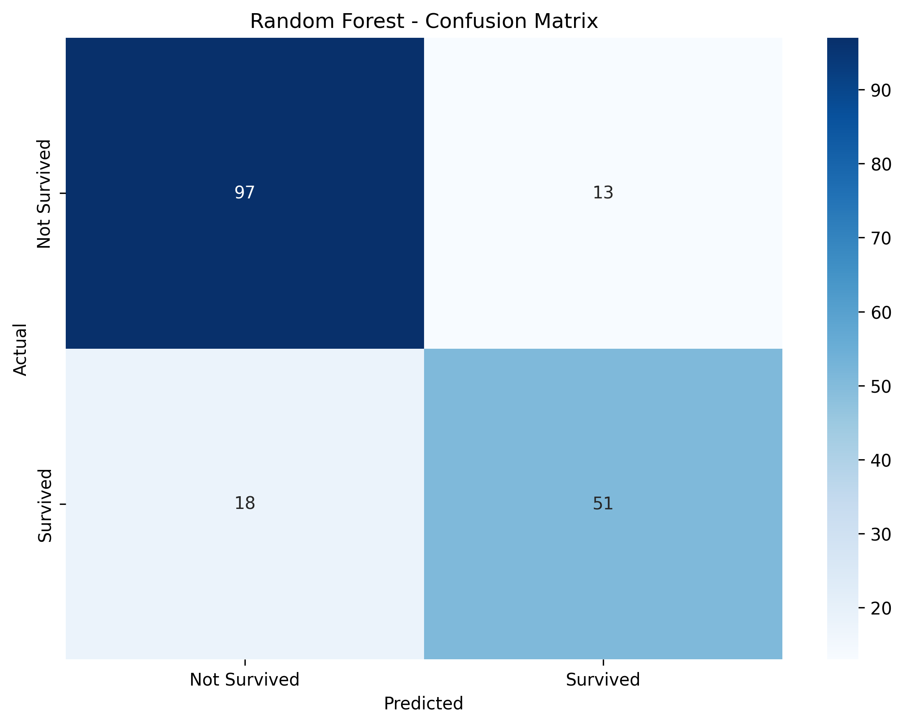
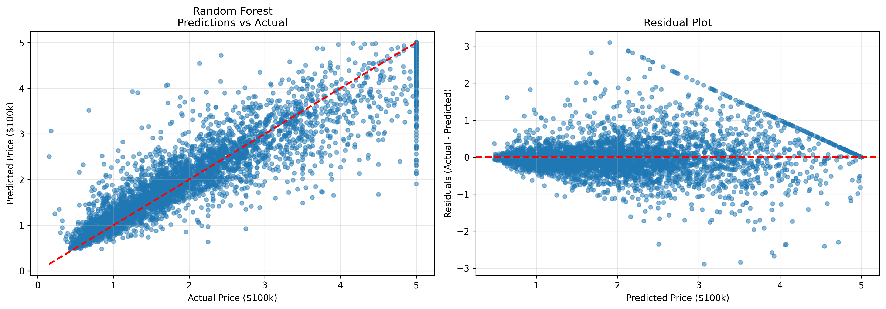

# Machine Learning Fundamentals

**Purpose**: Build foundational ML competency through structured learning and hands-on projects.

**Status**: In Progress - Practical Phase (Classification)

## Learning Journey

### Phase 1: Core Concepts (In Progress)

- [x] ML fundamentals and workflow
- [x] Train/test split and evaluation
- [x] Classification vs regression
- [x] Overfitting and generalization

### Phase 2: Classification Project

- [x] Data preparation and feature engineering
- [x] Model training and evaluation
- [x] Performance visualization

#### Classification: Titanic Survival Prediction

**Objective:** Predict passenger survival using binary classification

**Approach:**

- Feature engineering: Created FamilySize and IsAlone features
- Models: Logistic Regression vs Random Forest

**Results:**

- **Best Model:** Random Forest
- **Test Accuracy:** 82.68%
- **Key Decision:** Chose Random Forest despite 15.5% overfitting gap because test performance was superior (82.7% vs 80.5%)

[View Confusion Matrix](02_classification/results/confusion_matrix.png)  
[Detailed Project Documentation](02_classification/README.md)  
[View Code](02_classification/classification_project.py)

#### Results Visualization

**Confusion Matrix**



The confusion matrix shows:

- **97 True Negatives:** Correctly predicted non-survivors
- **51 True Positives:** Correctly predicted survivors
- **13 False Positives:** Predicted survival incorrectly
- **18 False Negatives:** Missed survival predictions

### Phase 3: Regression Project

- [x] Feature scaling and engineering
- [x] Multiple model comparison
- [x] Results interpretation

#### Key Decisions

**Feature Engineering:**

- Created RoomsPerPerson
- Created BedroomRatio (ratio shows bedroom density)
- Created PeoplePerRoom (population density metric)
- Rationale: Ratios often more predictive than raw counts

**Model Choice:**

- Linear Regression: Baseline, fast
- Random Forest: Better for non-linear patterns
- Winner: Random Forest

**Scaling:**

- StandardScaler important for regression
- Features on different scales: Population (thousands) vs Latitude (tens)
- Linear models fail without scaling

#### Results

- Test MAE: $32.84k - average prediction error
- Test RMSE: $50.48k - penalizes large errors more
- Test R²: 0.8055 - explains 80.6% of price variance

#### Learnings

- Feature engineering (ratios) improved R² by ~0.05
- Random Forest beat Linear Regression (R² 0.8055 vs 0.6524)
- Proper scaling essential - without it, Linear Regression R² was negative

#### Visualization

**Plots**



## Technical Stack

- Python 3.9+
- scikit-learn
- pandas, numpy, matplotlib

## Repository Structure

```
01_concepts/       Learning notes
02_classification/ Binary classification pipeline
03_regression/     Continuous value prediction
```

## Current Focus

Completing Google ML Crash Course and building conceptual foundation.
Completed Classification Project (used Kaggle's Titanic dataset).
Completed Regression Project (sklearn's built-in dataset).
